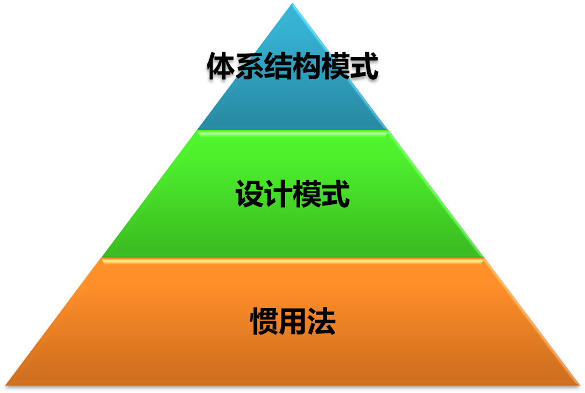

# 软件体系结构

代码实现可见链接：[代码实现](https://github.com/fengshiqi1998/SACodes)

## 什么是模式

- 模式是一条由三部分组成的**规则**。
- 一个特定**环境**、一个**问题**、一个**解决方案**。
- 模式的**核心思想**：进行设计的**复用**。 

## 设计模式与体系结构模式 

### 设计模式

描述了定制化的相互通信的**对象与类**， 以解决**特定环境**中的**通用设计问题**。

### 体系结构模式

是对**系统的高层设计**，是从一个较 高的层次来考虑组成系统的**构件**、构件之间的**连接关系**，以及系统需满足的**约束**等，用以实现体系结 构级的**设计复用**。通常又被成为**架构模式**、**体系结构风格**。

### 关系

