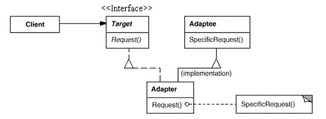
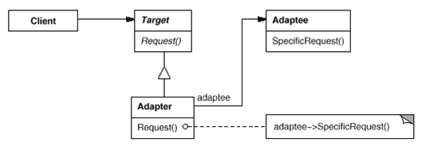
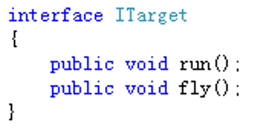
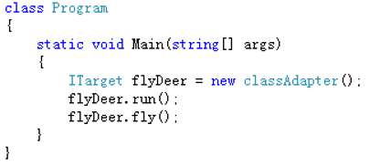
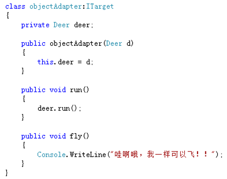
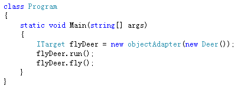

## 适配器模式

### 问题

- 想使用一个**已经存在的类**， 但他的**接口不符合**需求。
- 将一个类的接口**转换**成客户希望的另外一个接口 使得原本由于**接口不兼容**而不能一起工作的那些类可以**一起工作**。

### 适配器模式（ Adapter Pattern） 

#### 适配器模式中有以下的四种角色：

- **目标(target)**：定义客户端使用的与特定领域相关 的接口。
- **被适配者(adaptee)**：定义了一个已经存在的接口 ，这个接口需要匹配。
- **适配者(adapter)**：对Adaptee的接口与target的接 口进行适配。
- 客户端(Client)：与符合target接口的对象协同。

#### 模式分类

类的适配器模式（采用**继承**实现）

对象适配器（采用**对象组合**方式实现）

### 适配器模式实现步骤

**类适配器**：
-  确定目标接口
-  确定被适配者
-  创建适配器（继承自被适配者，实现目标接口） 

**对象适配器**：
 - 确定目标接口
 - 确定被适配者
 - 创建适配器（拥有被适配者的对象，实现目标接口）

#### 步骤一：被确定目标接口

#### 步骤二：被确定被适配者

#### 步骤三

- 创建适配器（类适配器）

- 创建适配器（对象适配器）

### 类适配器和对象适配器哪个更好 

- 类适配器采用“多继承”的实现方式，带来了 不良的高耦合
- 对象适配器采用“对象组合”的方式，更符合 松耦合精神
- **类适配器无法面对多个被适配对象**

合成复用原则