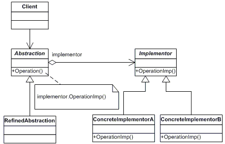
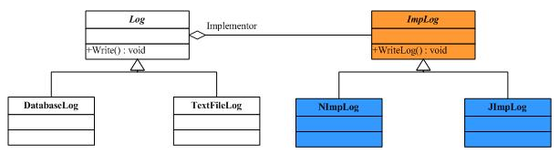
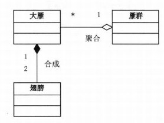

# 桥接模式

## 环境

- 现在我们要开发一个通用的日志记录工具
- 它既可以运行在.NET平台，也可以运行在Java平台上
- 它支持数据库记录和文本文件记录

## 详解

### 在软件系统中，应对“**多维度的变化**”，应将抽象部分与实现部分**分离**。

### 把日志记录方式和不同平台上的实现分别当作**两个独立的部分**来对待，我们要做的工作就是把这两部分之间**连接起来**。Bridge使用了**对象组合**的方式。

### 合成/聚合复用原则

- 合成（**组合**，Composition）和**聚合**（Aggregation）都是关联关系的特殊种类。
- **聚合表示一种**弱的“拥有”关系**，A对象可以包含B对象，但B对象不是A对象的一部分。
- **合成**表示一种**强的“拥有”关系**，体现了严格的整体和部分的关系，部分和整体的生命周期是一样的。

