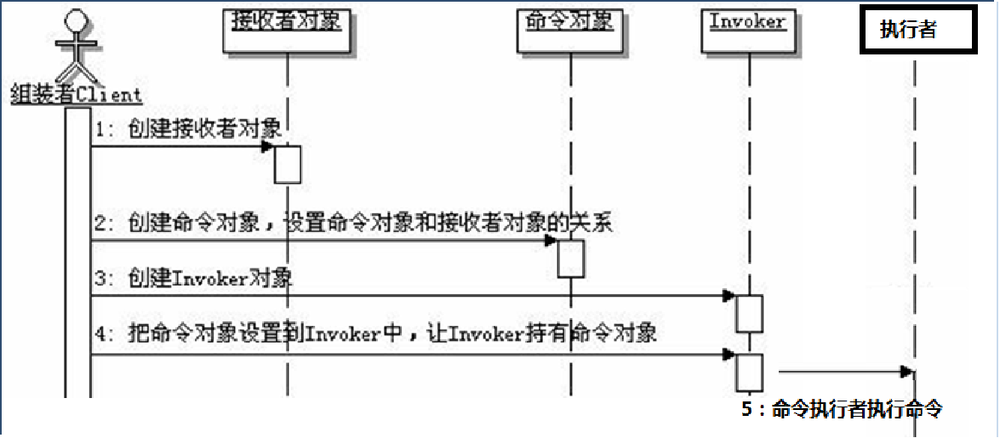
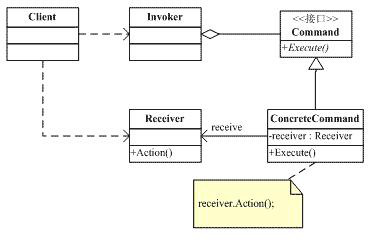
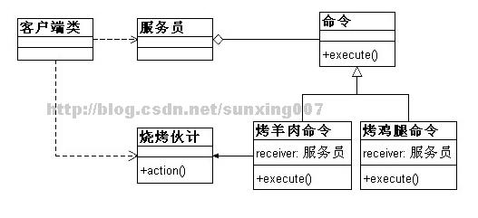

# 命令模式

## 环境

- 回想吃烧烤流程，多个客户，多个厨师。
- 客户想要吃5个烤鸡腿，10个烤羊肉串。

## 问题

- 背景：一个用户要对多个目标进行调用，而且目标对象的操作相似。
- 用户使用的**复杂性加大，目标的执行效率会比较低**。
- 增加目标的使用者的话，逻辑较复杂。
- 互动关系不能体现成类之间的直接调用，对象之间**关系的耦合度大**。

## 详解

### command pattern

- 让行为的**发送者**和**执行者**完全**解耦**。
- 当用户发出命令后，无需关注谁来执行命令，有转发者来进行命令的调配和转发。
- 将命令的发出者和命令的执行者完全**隔离**开。

### 角色

- Command：定义命令的接口，声明执行的方法。
- ConcreteCommand：命令接口实现对象， 通常会持有接收者，并调用接收者的功能来完成命令要执行的操作。
- Receiver：接收者，真正执行命令的对象。
- Invoker：传递者，要求命令对象执行请求，通常会持有命令对象，可以持有很多的命令对象。
- Client：创建具体的命令对象，并且设置命令对象的接收者。组装命令对象和接收者，因为真正使用命令的客户端是从Invoker来触发执行。

客户端发出命令给传递者，传递者把命令传递给真正执行命令的执行者去执行操作。

命令模式有很多种实现形式，比较常见的一种是“客户下达命令-----传达者接收，并传递给执行者----执行者接收到命令，执行命令”。

## 实现

