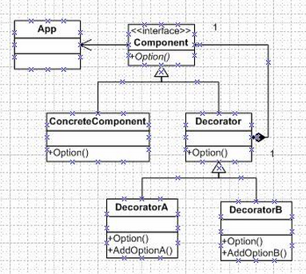

# 装饰模式

## 环境

- 汽车4s店汽车销售
- 出售奥迪A1，A4，A6；
- 可装饰的组件倒车雷达，真皮座椅，gps定位
- 用户可以挑选汽车的型号，加任意的组件

## 问题

- 不必改变原类文件和使用继承的情况下，动态的扩展一个对象的的功能。
- 应用程序的可维护性，可扩展性差。

## 详解

### 装饰模式

- 装饰模式中的角色：油漆工(decorator)是用来刷油漆的；被修饰者(decoratee)是被刷油漆的对象。

- **动态**给一个对象**添加一些额外的功能和职责**，就象在墙上刷油漆。

- 实现装饰模式有很多形式，最常见的一种就是**“实现被装饰者类---定义被装饰者对象----使用被装饰者对象产生装饰者对象”**。

### 设计类图

## 实现

- 首先定义被装饰者类
- 通过被装饰者对象产生装饰者对象

