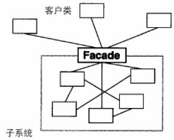

# 外观模式

## 背景

用户希望使用一个比较**复杂的子系统**。但是用户不希望跟子系统的复杂的模块交互，也不想了解复杂的子系统内部的结构，且子系统结构变化后，不需要改变用户的使用方式。

## 详解

### Facade

- 为子系统中的**一组接口**提供一个**一致的界面**，外观模式定义了一个高层接口，这个接口使得这一子系统更加**容易使用**。
- 使客户**尽量少的与子系统内部的组件打交道**，尽量维护子系统的统一的接口。
- 使系统的用户和系统通过façade类**解耦**。当子系统改变时，只要保证façade类的接口不变，用户的使用方式就无需改变。
- 外观模式的实现一般采用：在子系统外部封装façade类的方式实现。

### 角色

- 目标类:  子系统类的合集。
- 外观类:  一个相对复杂的子系统类的外观类。
- 客户端类:  要使用子系统类中各个方法的用户类。

