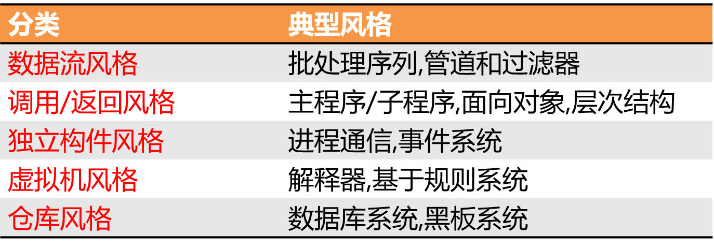
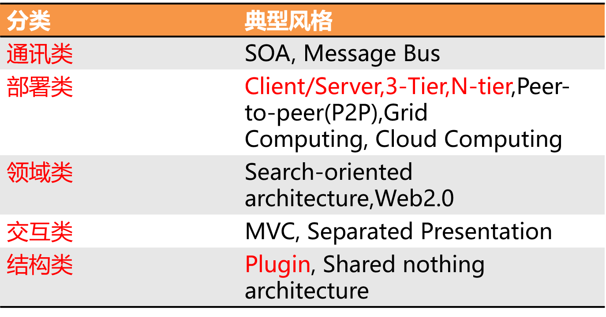
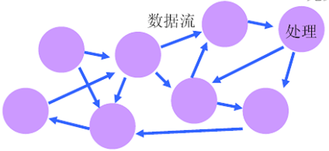

# 管道过滤器

## 体系结构的概念

软件体系结构 = 软件 的 体系结构

### 什么是体系结构

软件体系结构起源——**建筑业**

#### 如何使用基本的建筑模块构造一座完整的建筑？

包含两个因素：

- 基本的建筑模块
- 建筑模块之间的粘接关系

#### 体系结构的共性

- 一组基本的构成元素—**构件**
- 这些要素之间的连接关系—**连接件**
- 这些要素连接之后形成的拓扑结构—**物理分布**
- 作用于这些要素或连接关系上的限制条件—**约束**
- 质量—**性能**

**体系结构 = 构件 + 连接件 + 约束**

## 体系结构的风格（分类）

### 经典SA风格

### 其他常用SA风格

### 异构（复合）SA风格

## 数据流风格

### 概念

数据从一个处理单元流入到另一个处理单元，每经过一个单元就做一次转换。

**注意**：数据流风格不是某个过程的数据流图，它描述的是系统体系结构级别的设计，**体系结构风格是系统级的**。

### 直观理解

### 基本构件（Component）

- 基本构件：数据处理
- 构件接口：输入端口和输出端口

### 连接件（Connector）

连接件：数据流

### 拓扑结构（Topology）

任意拓扑结构的**图**

- 一般来说，数据的流向是**无序**的
- 我们主要关注近似线性的数据流
- 或在限度内的循环数据流

### 三种典型的数据流风格

#### 管道/过滤器（Pipe-and-Filter）

数据流的转换作为单独的过程

#### 批处理（Batch Sequential）

转换可以顺序地或并行地执行，数据加工逐项进行

#### 过程控制（Process Control）
