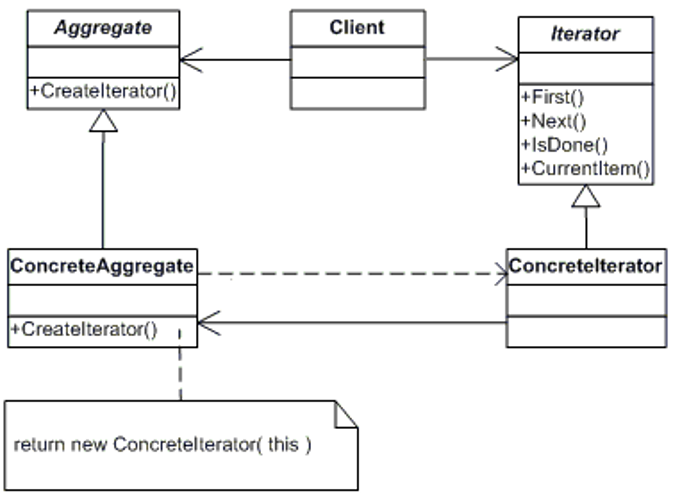

# 迭代器模式

## 环境

在软件构建过程中，**集合**对象内部结构常常变化各异。但对于这 些集合对象，我们希望在不暴露其内部结构的同时，可以让外部 客户端代码透明地访问其中包含的元素；同时这种“**透明遍历**” 也为“ **同一种算法在多种集合对象上进行操作**”提供了可能。

## 应用场景

- 访问一个集合**对象的内容**，**而无需暴露它的内部表示**。
- 支持对集合对象的多种遍历。
- 为遍历不同的集合结构提供一个**统一的接口**(即, 支持多态迭代) 。

## 迭代器模式详解 

### 概念

- 又叫做**游标**（Cursor）模式。
- 提供一种方法**访问一集合**对象中各个元素，而 又**不需暴露**该对象的**内部细节**。
- 迭代器模式是**为容器（或者集合）而生**。

### 四种角色

- 抽象集合：一个接口，规定了具体集合需要实现的操作。
- 具体集合：具体的集合按照一定的结构存储对象。具体集合应该有一个方法，该方法返回一个针对该 集合的具体迭代器。
- 抽象迭代器：一个接口，规定了遍历具体集合的方法，比如 next()方法。
- 具体迭代器：实现了迭代器接口的类的实例。

### 设计类图

## 迭代器模式实现

## 扩展说明

### 优缺点

**优点：** 

- 简化了遍历方式
- 可以提供多种遍历方式（正序遍历，倒序遍历……）
- 封装性良好

**缺点：**

- 对于比较简单的遍历（像数组或者有序列表），使 用迭代器方式遍历较为繁琐，大家可能都有感觉， 像ArrayList，我们宁可愿意使用for循环和get方法 来遍历集合
