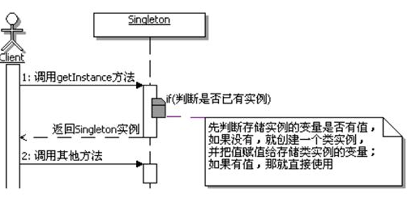
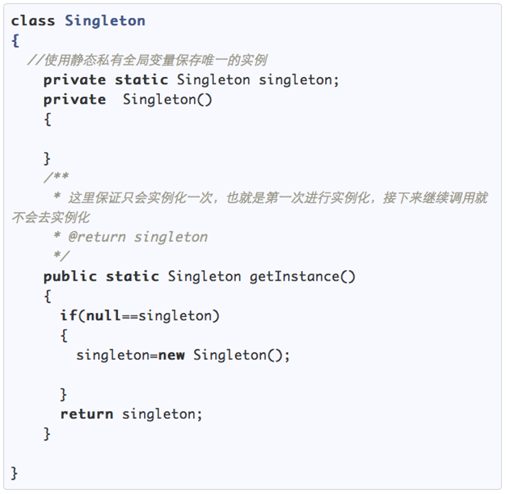

# 单例模式

## 概念

**确保一个类仅有一个唯一的实例，并且提供一个全局的访问点**

## 环境及问题

### 环境——一个类可以创建多个对象

### 单例模式要解决的问题——**独生子女**

## 解决方案

- 首先将构造函数声明成私有类型，屏蔽通过直接实例化的形式来访问。
- 其次控制全局只有一个实例的类—Static。
- 第三，提供一个可以获得实例的方法，用于返 回类的实例，并保证得到的是同一个对象。

### 代码实现（JAVA）

## 单例模式的应用举例

- Windows的Task Manager（任务管理器）
- 网站的计数器、  应用程序的日志应用
- 数据库连接池的设计
- Web应用的配置对象的读取
- 操作系统的文件系统

## 单例模式的应用场景

- 资源共享的情况下，避免由于资源操作时导致的性能损耗。如上述中的日志文件，应用配置
- 控制资源的情况下，方便资源之间的互相通信。如数据库连接池等
