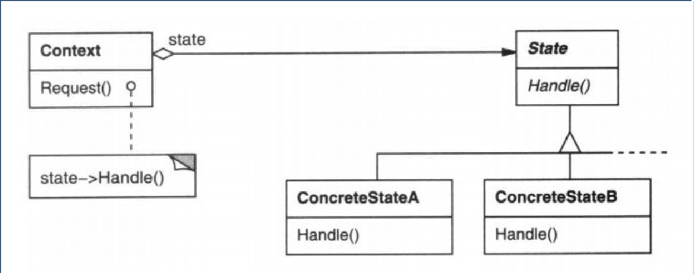

# 状态模式

## 环境

- 实现一个旅馆的住宿管理系统
- 房间的状态有三种：空闲，预定，入住

## 问题

- 背景：某对象发生**变化时**，其所能做的操作也随之变化。
- 应用程序的**可维护性和重用性差**。
- 代码的**逻辑较复杂**。

## 详解

### state模式

#### 允许对象在其**内部状态改变**的时候**改变**它的**行为**。

#### 角色

- 环境类（Context）:  客户使用的对象类。维护一个State子类的实例，这个实例定义当前状态。
- 抽象状态类（State）:  定义一个接口以封装与Context的一个特定状态相关的行为。
- 具体状态类（ConcreteState）:  每一子类实现一个与Context的一个状态相关的行为。

## 实现

### 最常见的一种步骤

- 定义**状态类接口**，实现当前系统的真实状态**实现**此接口
- 定义Context类，具有状态的类，其中包含**状态类接口的对象**
- 当Context类执行某个接口的方法时，去**调用真实状态类的实现方法**
- 当Context类修改状态时，修改Context类的真实状态对象
