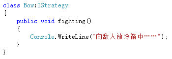
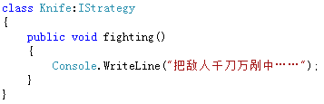
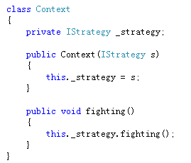
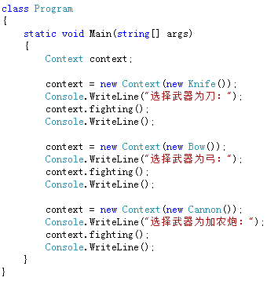

# 策略模式

## 问题

- 将每一个**一系列的算法封装**起来。
- 而且使它们还可以相互替换。
- 让**算法独立于**使用它的**客户**而**独立变化**。

## 详解

### strategy pattern

策略模式定义了**一系列的算法**，并将每一个**算法封装**起来，而且使它们还可以相互替换。策略模式让算法独立于使用它的客户而独立变化。

### 三种角色

- **抽象策略类(Strategy)**: 定义所有支持的算法的公共接口。 	
- **具体策略类(ConcreteStrategy)**: 以Strategy接口实现某具体算法。
- **环境类(Context)**: 维护一个对Strategy对象的引用。可定义一个接口来让Strategy访问它的数据。

## 实现

### 步骤

- 定义抽象策略类

- 实现具体策略类

- 定义环境类

