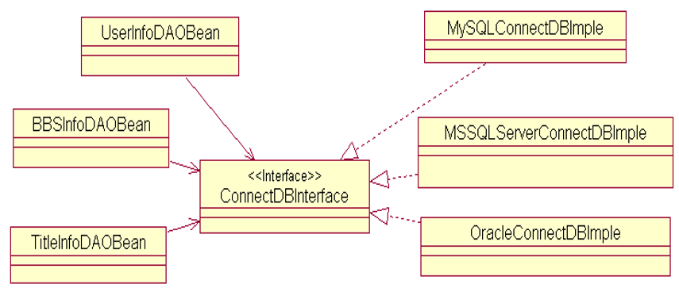
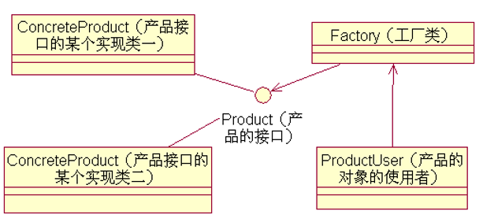
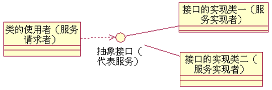

# 好设计的原则

## 不太好的代码的表现（设计正在“**腐烂**”的征兆）

- 过于僵硬  Rigidity
- 过于脆弱  Fragility
- 不可重用性  immobility
- 粘滞性过高  viscosity（修改代码时，耦合度太大）

## **好的系统设计**应具备的三个性质

- 可扩展性  Extensibility
- 灵活性  Flexibility
- 可插入性  Pluggability

## 面向对象设计原则

### 单一职责原则（SingleResponsibilityPrinciple）

#### 原则简介

类的职责要单一，不能将太多的职责放在一个类中。主要为了解耦和增强内聚性（高内聚、低耦合）。（高内聚：内部功能集中，相关度强；低耦合：类之间的关系明确）

- 高内聚性原则
- 避免相同的职责（功能）分散到不同的类中实现
- 避免一个类承担过多的职责

**可以减少类之间的耦合**

#### 单一职责原则生活中的实例

- 组织机构的设置
- 公司人员的分工

#### 单一职责原则示例

- 类的设计主要工作是“发现职责”并“分离职责”

**数据库连接和数据库访问操作相互分离**

#### 遵守单一职责原则的设计模式

##### 工厂模式

- 分离对象的“创建”和对象的“使用”

### 开闭原则（Open-ColsedPrinciple）

#### 原则简介

软件实体对扩展是开放的，但对修改时关闭，即在不修改一个软件实体的基础上去扩展其功能。（接口：只定义其方法名称，不定义其实现）

- Open：模块的行为必须是开放的、支持扩展的，而不是僵化的
- Closed：在对模块的功能进行扩展时，不应该影响或大规模地修改已有的程序模块
- **绝大部分的设计模式都符合开闭原则**
- **抽象化**是开闭原则的关键

**要求开发人员可以在不修改系统中现有的代码的前提下，而实现对应用系统的软件功能的扩展。**

### 里氏代换（替换）原则（向上转型）（Liskov Substitution Principle）

#### 原则简介

在软件系统中，一个可以接受基类对象的地方必然可以接受一个子类对象。

- 主要是**针对继承**的设计原则
- **子类型**必须能够**替换**掉它们的**父类型**，并出现在父类能够出现的任何地方
- 子类**可以扩展**父类的功能，但不**能改变**父类原有的功能
- 子类**可以实现**父类的抽象方法，但**不能覆盖**父类的非抽象方法。
- 子类中**可以增加**自己特有的方法。
- 当子类的方法重载父类的方法时，方法的前置条件（即方法的形参）要比父类方法的**输入参数更宽松**。
- 当子类的方法实现父类的抽象方法时，方法的后置条件（即方法的**返回值**）要比父类**更严格**。

#### 举例

生物学的分类体系中把企鹅归属为鸟类。模仿这个体系，设计出这样的类和关系

### 依赖倒转原则（Dependency Inversion Principle）

#### 原则简介

要针对抽象层编程，而不要针对具体类编程

将依赖关系倒置为

- 上层模块不应该依赖于下层模块，它们共同依赖于一个抽象
- 父类不能依赖子类，它们都要依赖抽象类
- 抽象不能依赖于具体，具体应该要依赖于抽象

图中两个模块之间定义一个抽象接口，上层模块调用抽象接口中定义的方法，下层模块实现该接口的方法

### 接口隔离原则（Interface Segregation Principle）

#### 原则简介

使用多个专门的接口来取代一个统一的接口

- 一个类对另外一个类的依赖性应当是建立在**最小的接口上**
- 客户端**不应该依赖**那些它**不需要的接口（方法）**

该原则指导我们如何正确地进行接口设计：谨用继承！

过于臃肿的接口设计是对接口的污染（Interface Contamination）

 一个没有经验的设计师往往想节省接口的数目，将一些功能相近或功能相关的接口合并

所谓接口污染就是为接口添加了不必要的职责

 如果开发人员在接口中增加一个新的功能方法的主要目的只是为了减少接口的实现类的数目，如此设计将导致接口被不断地“污染”并“变胖”。

#### 如何避免不良的接口设计

- 用多个专门的接口，而不使用单一的总接口。
- 一个接口就只代表一个角色
- 使用接口隔离原则拆分接口时，首先必须满足单一职责原则

软件系统中类的设计是否合理不在乎类本身的数目：

- 接口污染会给系统带来维护和重用等方面的问题。
- 为了能够重用被污染的接口，接口的实现类就被迫要实现并维护不必要的功能方法。
- 使用接口的多重继承实现对不同的接口的组合，从而对外提供组合功能——达到“按需提供服务”。

### 合成复用原则（Composite Reuse Principle）

#### 原则简介

在系统中应该尽量多使用组合和聚合关联关系， 尽量少使用甚至不使用继承关系

- 又称为**组合/聚合**复用原则
- **尽量使用对象组合**，而不是继承来达到复用目的
- 一个新的对象里通过**关联关系（包括组合关系和聚合关系）**来使用一些已有的对象
- 新对象**通过委派调用已有对象的方法达到复用**其已有功能的目的
- **继承复用**：实现简单，易于扩展，没有足够的灵活性（“**白箱**”复用 ）
- **组合/聚合复用**：耦合度相对较低，选择性地调用成员对象的操作；可以在运行时动态进行。（“**黑箱**”复用 ）

**尽量使用组合/聚合关系，少用继承**

### 迪米特法则（Law of Demeter）

#### 原则简介

一个软件实体对其他实体的引用越少越好，或者说如果两个类不必彼此直接通信，那么这两 个类就不应当发生直接的相互作用，而是通 过引入一个第三者发生间接交互

- 要求一个软件实体应当**尽可能少**的与其他实体发生相互作用
- 又称为**最少知识**原则
不要和“陌生人”说话
只与你的直接朋友通信
每一个软件单位对其他的单位都只有最少的知识，而且局限于那些与本单位密切相关的软件单位

**创建松耦合的类**

#### 应用时注意

- 在类的划分上，应该创建有弱耦合的类；
- 在类的结构设计上，每一个类都应当尽量降低成员的访问权限；
- 在类的设计上，只要有可能，一个类应当设计成不变类；
- 在对其他类的引用上，一个对象对其它对象的引用应当降到最低；
- 尽量降低类的访问权限；
- 谨慎使用序列化功能；
- 不要暴露类成员，而应该提供相应的访问器(属性)

## 总结

- 单一职责原则要求在软件系统中，一个类只负责一个功能领域中的相应职责。
- 开闭原则要求一个软件实体应当对扩展开放，对修改关闭，即在不修改源代码的基础上扩展一个系统的行为。
- 里氏代换原则可以通俗表述为在软件中如果能够使用基类对象，那么一定能够使用其子类对象。
- 依赖倒转原则要求抽象不应该依赖于细节，细节应该依赖于抽象；要针对接口编程，不要针对实现编程。
- 接口隔离原则要求客户端不应该依赖那些它不需要的接口，即将一些大的接口细化成一些小的接口供客户端使用。
- 合成复用原则要求复用时尽量使用对象组合，而不使用继承。
- 迪米特法则要求一个软件实体应当尽可能少的与其他实体发生相互作用。
