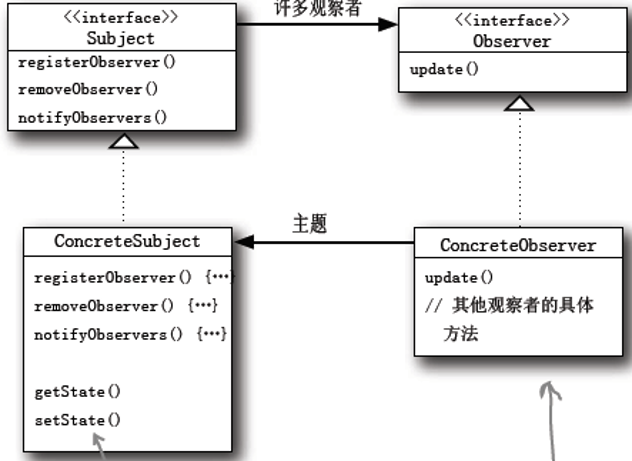

### 观察者模式（Observer Pattern）

#### 问题

- **背景**：某对象发生变化，需其他对象做出**调整**。
- 应用程序的**可维护性和重用性**。 
- 互动关系不能体现成类之间的直接调用，对象之间**关系的解耦**。

#### 详解

- 又叫**发布-订阅**模式。
- **两个角色**：观察者和被观察对象
- 两者之间存在“**观察**”的逻辑关联
- 当**被观察者发生改变**的时候，**观察者就会**观察到这样的变化，并且做出相应的**响应**
- **“观察”不是“直接调用”** 
- 实现观察者模式有很多形式，比较直观的一种是使用一种“**注册——通知——撤销注册**”的形式。

#### 实现步骤

**观察者将自己注册到被观察对象中，被观察对象将观察者存放在一个容器里**

**被观察对象发生了某种变化，从容器中得到所有注册过的观察者，将变化通知观察者。**

**观察者告诉被观察者要撤销观察，被观察者从容器中将观察者去除。**

#### 设计类图

#### 扩展说明

- 在.NET框架中，使用**代理以及事件**，可以更好的实现观察者模式。
- 在事件的模式下，声明事件的类就是被观察者。
- IObserver和ISubject接口的方法可以减少观察者和观察对象之间的耦合，而代理和事件几乎消除了这两个模块之间的耦合。
